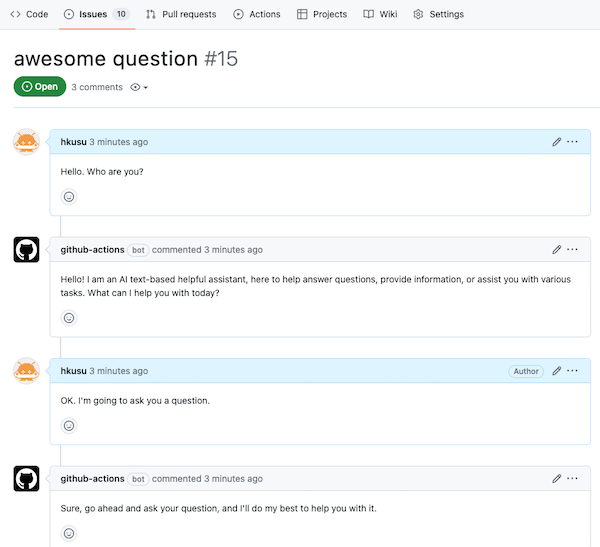

# OpenAI Chat on Issues

This is a GitHub Actions for running OpenAI's chat on GitHub Issues.



## Usage

```
name: OpenAI Chat

on:
  issues:
    types: [opened]
  issue_comment:
    types: [created]

jobs:
  chat:
    name: Chat
    runs-on: ubuntu-latest
    steps:
      - uses: snnaplab/openai-chat-on-issues@v1
        with:
          openai-key: ${{ secrets.OPENAI_KEY }}
          model: 'gpt-4' # option, default is 'gpt-3.5-turbo'
          system-prompt: | # option
            You are a helpful assistant.
```
